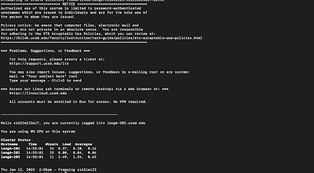

# Part 1 Setting Up VSCode
---
1.  Go to the Visual Studio Code website: [(https://code.visualstudio.com/)](https://code.visualstudio.com/) and follow the instructions to download. Ensure that the instructions match your specific operating system (macOS, windows, etc).
2.  For my system (macOS), after downloading, locate the downloaded app or archive on your computer.
3.  If archive, extract the archive by double-clicking the file.
4.  Drag the Visual Studio Code download into the Applications folder. 
5.  Double-click VS Code to open it and your screen should resemble the image below.


# Part 2 Remotely Connecting
---
1. First step is to install Git for your specific operating system (in my case macOS) by going to [(https://git-scm.com/download/mac)]((https://git-scm.com/download/mac)).
2. Next, open a terminal on VScode (Terminal -> New Terminal menu option).
3. Then type `ssh cs15lwi23aif@ieng6.ucsd.edu` (The aif at the end will be replaced with your specific letters).
4. After clicking enter you will receive something that looks like below. Simply type `yes` and click enter. Enter your password for your `cs15lwi23aif` account.
```
⤇ ssh cs15lwi23aif@ieng6.ucsd.edu
The authenticity of host 'ieng6.ucsd.edu (128.54.70.227)' can't be established.
RSA key fingerprint is SHA256:ksruYwhnYH+sySHnHAtLUHngrPEyZTDl/1x99wUQcec.
Are you sure you want to continue connecting (yes/no/[fingerprint])? 
```
5. Your terminal will look something like below after connecting to the remote server. Your computer is now the client and the computer basement serves as the server.



6. ASK QUESTIONS! If you ever encounter a problem or issue, ensure that you completed the previous steps accurately and your password for your account is correct.


# Part 3 Trying Some Commands
---
1. In order to get a better idea of the environment, try running some commands. Pick and choose from the commands below. I tried some for you in the image below.
```
cd ~ (changes directory)
mkdir (makes new directory)
ls -lat (lists all files in long list format sorted by modification time)
ls -ah (lists all human readable files)
pwd (prints working directory)
```

2. After trying some of these commands, I suggest you look up some more online and try to implement them on this server. The more you practice, the better you'll get!
