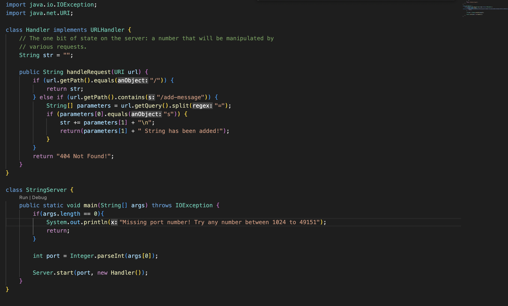
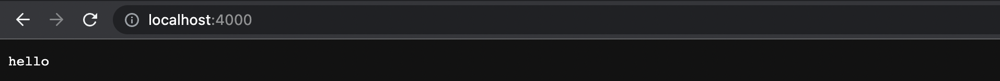
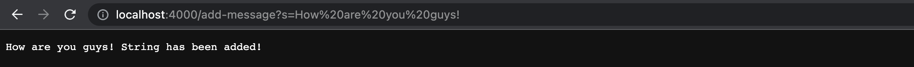
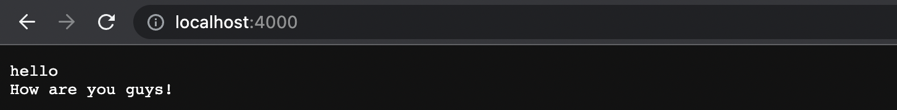
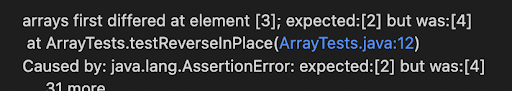
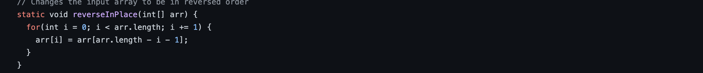
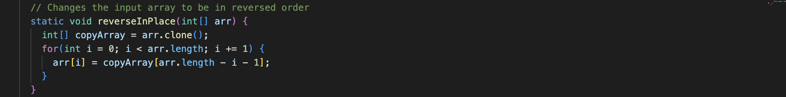

# Part 1: String Server
---
Code for StringServer.java:




1. When you type `java StringServer [Port]`, You run the main method in the StringServer class. This class then uses the Server class method start(port, new Handler) to start the web server. The handleRequest method in Handler class is also called to take the url and execute certain code based on the url and display it on the web browser for the user.

2. The main method of the StringServer class takes a String[] args argument in order to use the port to start the web server. The handleRequest method takes a URI which in our case, isn't much different from a url. The String[] parameters takes the url we add to the end and determines the message added to the string.

3. Some fields that changed is the `URI url`, `String[] parameters`, and `str` changed after adding my code. Url took my added `add-message?s=hello`, parameters took the `s=hello` and str adds `hello` and `\n` to the end.




1. The same methods are being called as the one in the first set of screenshots. The main method in StringServer class and then the start(port new Handler) to start the web server. The handleRequest method in Handler class is also used to read the url and execute code to show on web browser.

2. The main method of the StringServer class takes a String[] args argument in order to use the port to start the web server. The handleRequest method takes a URI which in our case, isn't much different from a url. The String[] parameters takes the url we add to the end and determines the message added to the string.

3. Some fields that changed is the `URI url`, `String[] parameters`, and `str` changed after adding my code. Url took my added `add-message?s=How are you guys!`, parameters took the `s=How are you guys!` and str adds `How are you guys` and `\n` to the end.

# Part 2: Buggy Program
---
Failure inducing:
```
int[] input2 = { 1, 2, 3, 4, 5};
ArrayExamples.reverseInPlace(input2);
assertArrayEquals(new int[] {5,4,3,2,1}, input2);
```
Non-failure code:
```   
int[] input1 = { 3 };
ArrayExamples.reverseInPlace(input1);
assertArrayEquals(new int[]{ 3 }, input1);
```
Symptoms:



Bug Before:


After:


Fix:
The bug with the code was that it was simultaneously changing the code while referring back to earlier indexes to complete the replacement of the later indexes. To fix this, I cloned the array into a separate copyArray and iterated through that, and copied the values into the array.

# Part 3
---

I learned how to start a web server from my computer and update it using the url. I also learned how to use JUnit as a method of testing my Java code. JUnit will be useful when coding in Java on my PAs.


