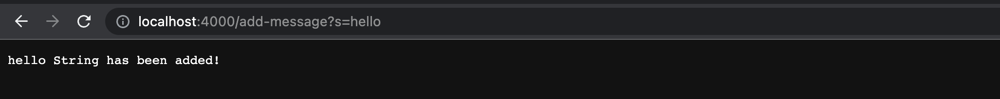

# Part 1: String Server
---
Code for StringServer.java:

1. When you type `java StringServer [Port]`, You run the main method in the StringServer class. This class then uses the Server class method start(port, new Handler) to start the web server. The handleRequest method in Handler class is also called to take the url and execute certain code based on the url and display it on the web browser for the user.

2. The main method of the StringServer class takes a String[] args argument in order to use the port to start the web server. The handleRequest method takes a URI which in our case, isn't much different from a url. The String[] parameters takes the url we add to the end and determines the message added to the string.

3. Some fields that changed is the `URI url`, `String[] parameters`, and `str` changed after adding my code. Url took my added `add-message?s=hello`, parameters took the `s=hello` and str adds `hello` and `\n` to the end.

