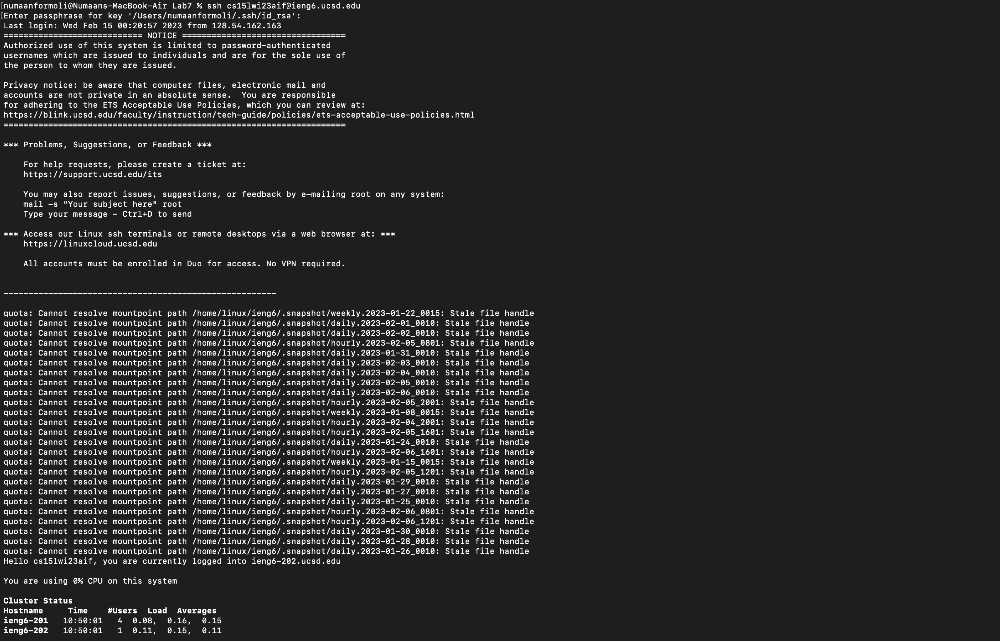
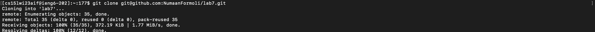
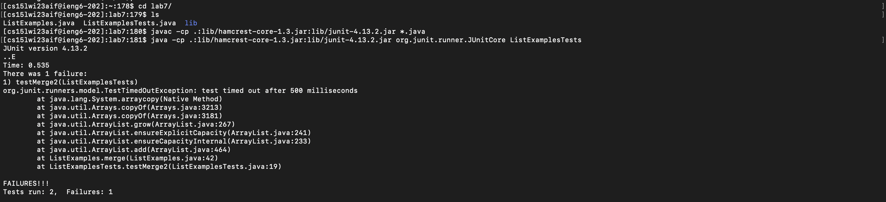
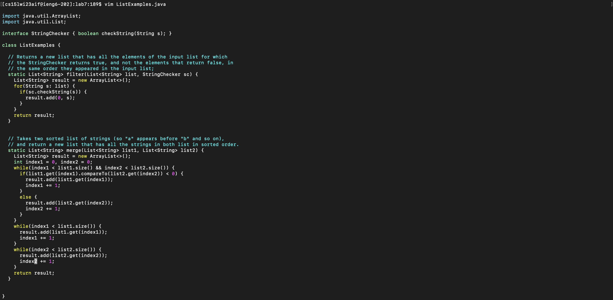
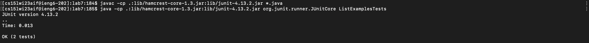
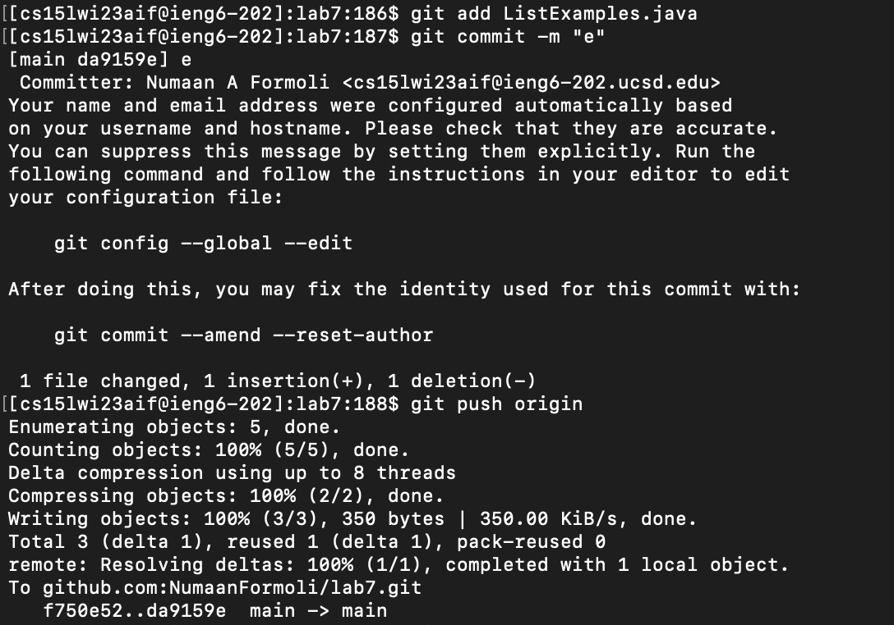

# Lab Report 4: 

1. Log into ieng6
  
  - Keys Pressed: `<Ctrl-C>, Ctrl-V>, <enter>`
  - I ran `ssh cs15lwi23aif@ieng6.ucsd.edu` by copy and pasting from a notepad I have saved of my login for ieng6.

2. Clone your fork of the repository from your Github account
  
  - Keys Pressed: `<up>,<up>,<Ctrl-C>,<Ctrl-V>,<enter>`
  - I used the arrow key to go up twice as I had the `git clone` command saved in my recent history. I then copied and pasted my ssh github URL into the commandline and cloned the repository.

3. Run the tests, demonstrating that they fail
  
  - Keys Pressed: 
      - `cd,<space>,l,<tab>,<enter>`
      - `ls,<enter>`
      - `<Ctrl-R>,javac,<enter>
      - `<Ctrl-R>,List,<enter>`
  - I first `cd` into the directory and type `l` and `<tab>` after to complete `lab7`. I entered `ls` to ensure its the right directory. The commands `javac -cp .:lib/hamcrest-core-1.3.jar:lib/junit-4.13.2.jar *.java` and `java -cp .:lib/hamcrest-core-1.3.jar:lib/junit-4.13.2.jar org.junit.runner.JUnitCore ListExamplesTests` were in my command history and `<Ctrl-R>` allows me to search for them. So I searched each of them with key words `javac` and `List` and ran it

4. Edit the code file to fix the failing test
  
  - Keys Pressed: 
      - `vim,<space>,L,<tab>,.j<tab>,<enter>`
      - `/index1 += 1,<enter>,n,n,ea,i,<delete>,2,<esc>,:x,<enter>`
  - I used vim editor to make the changes necessary. I typed `vim L` and used `<tab>` to finish it. I then used the `/` search function in vim to search for `index1 +=1`. In addition, to that i press `n` twice as that goes to the next occurrence. This brings me the front of the line that I want to edit. I then type `ea` to get to the end of `index1`. Press `i` to get into insert mode and change `index1` to `index2`. I pressed `<esc>` and `:x` to save and quit.

5. Run the tests, demonstrating that they now succeed
  
  - Keys Pressed:
      - `<up>,<up>,<up>,<up>,<enter>`
      - `<up>,<up>,<up>,<up><enter>`
  - I rerun the `javac -cp .:lib/hamcrest-core-1.3.jar:lib/junit-4.13.2.jar *.java` by going up 4 in my history and simply pressing enter. I rerun `java -cp .:lib/hamcrest-core-1.3.jar:lib/junit-4.13.2.jar org.junit.runner.JUnitCore ListExamplesTests` again by going up 4 times in my history after running the command above.

6. Commit and push the resulting change to your Github account
  
  - Keys Pressed:
      - `git,<space>,add,<space>,L,<tab>,.j,<tab>,<enter>`
      - `git,<space>,commit,<space>,-m,<space>,"e",<enter>`
      - `git<space>push<space>origin`
  - I first add `ListExamples.java` to the commit using tab to finish the command. I then make the commit with a short message indicating edit like so, `-m "e"`. I finish by manually typing out `git push origin` to push the commit to the remote repository.

1
2
3

steps 4-9
screenshot for every step

1. I ssh into the account
- I ctrl-c, ctr-l, enter

2. git clone repository
- <up><up> ctrl c ctrl v, enter
  
3. Run the Tests and show that they fail
 - cd lab<tab> <enter>
 - Crtl-R><javac><enter>
 - Crtl-R<List><enter>
  
 3. Edit File
 - vim <space> L <tab> .j<tab> <enter>
 - /index1 += 1<ente> n, n, ea, i, <delete> 2, <esc> <:x> <enter>
  
 4. Run Tests and show it works
 - <up><up><up> <enter>
 - <up><up><up><up> <enter>
  
 4. Commit to github and push
 - git<space>add<space>L <tab> .j<tab> <enter>
 - git<space>commit<space>-m<space> "e"
 - git<space>push<space>origin
