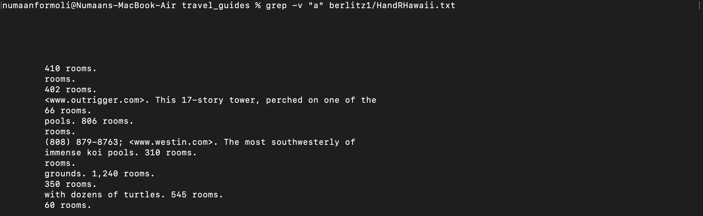
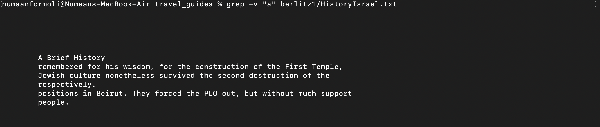

# Lab Report 4: Experimenting with grep command
---

1. Match regular expression in files using -r and -l

```
numaanformoli@Numaans-MacBook-Air written_2 % grep -r -l "t.*pw" non-fiction/

non-fiction//OUP/Berk/ch1.txt
non-fiction//OUP/Kauffman/ch3.txt
non-fiction//OUP/Kauffman/ch1.txt
non-fiction//OUP/Kauffman/ch7.txt
non-fiction//OUP/Kauffman/ch6.txt
non-fiction//OUP/Kauffman/ch8.txt
non-fiction//OUP/Fletcher/ch9.txt
non-fiction//OUP/Castro/chA.txt
non-fiction//OUP/Castro/chM.txt
non-fiction//OUP/Castro/chZ.txt

```
- In this example, I use the regex to search txt files in the non-fiction directory that has a pattern that starts with t and end with pw. I use the -r to search through the directory recursively and -l to only list the file name. This is useful if you want to search a directory for a certain pattern, say an email address, but dont want to grep each individual txt file. The * means that the preceding character will be matched zero or more times.
 

2. Invert match using grep -v
- 
- 
- In this example I use the command option -v which does an invert match meaning it returns the lines that does not contain that pattern. This would be useful in searching for a specific file that does not have a particular pattern.


3. Counting the number of matches using grep -c
- 
- 
- 


4. Show the position of match in the line


