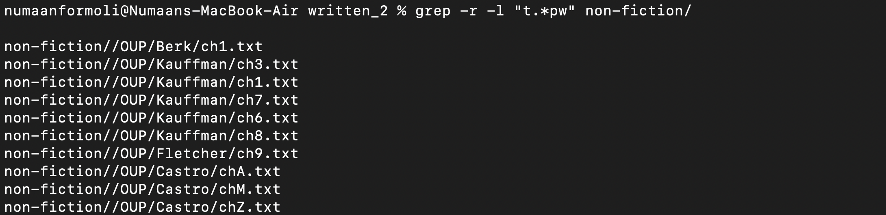
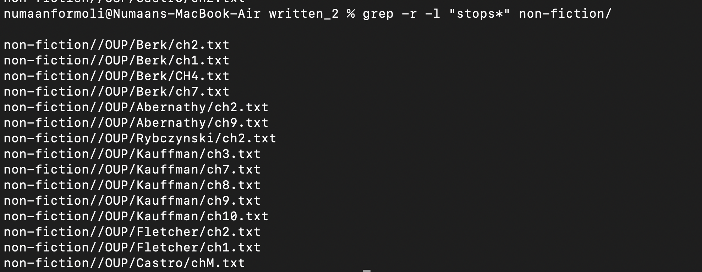

# Lab Report 4: Experimenting with grep command
---

1. Match regular expression in files using -r and -l

- 
- 
- In this example, I use the regex to search txt files in the non-fiction directory that has a pattern that starts with t and end with pw. I use the -r to search through the directory recursively and -l to only list the file name. This is useful if you want to search a directory for a certain pattern, say an email address, but dont want to grep each individual txt file. The * means that the preceding character will be matched zero or more times.
 

2. Invert match using grep -v
- 
- 

3. Counting the number of matches using grep -c

4. Show the position of match in the line

